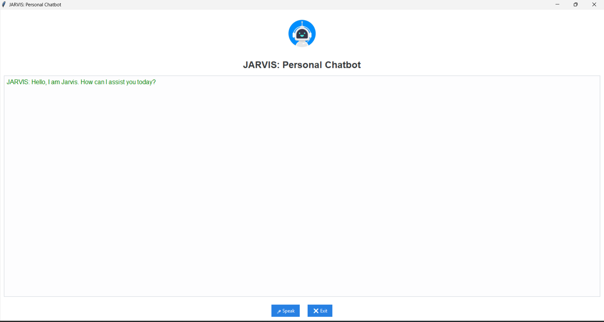

# JARVIS Voice Assistant  
A Python-based personal voice assistant with a modern GUI built using *Tkinter* and *ttkbootstrap*.  
It integrates speech recognition and text-to-speech to perform real-time voice interactions — an AI-inspired project demonstrating automation, UI design, and Python programming.  
---
## Features
- 🎙 Voice command recognition using SpeechRecognition API  
- 🗣 Text-to-speech responses with pyttsx3  
- 💬 Dynamic chat-style interface window  
- 🪄 Clean and modern GUI using ttkbootstrap
## Technologies Used
- Python  
- Tkinter  
- ttkbootstrap  
- SpeechRecognition  
- pyttsx3  
- Pillow (for image handling)
- ---
## GUI Preview  

---
## How to Run
1. Clone this repository

